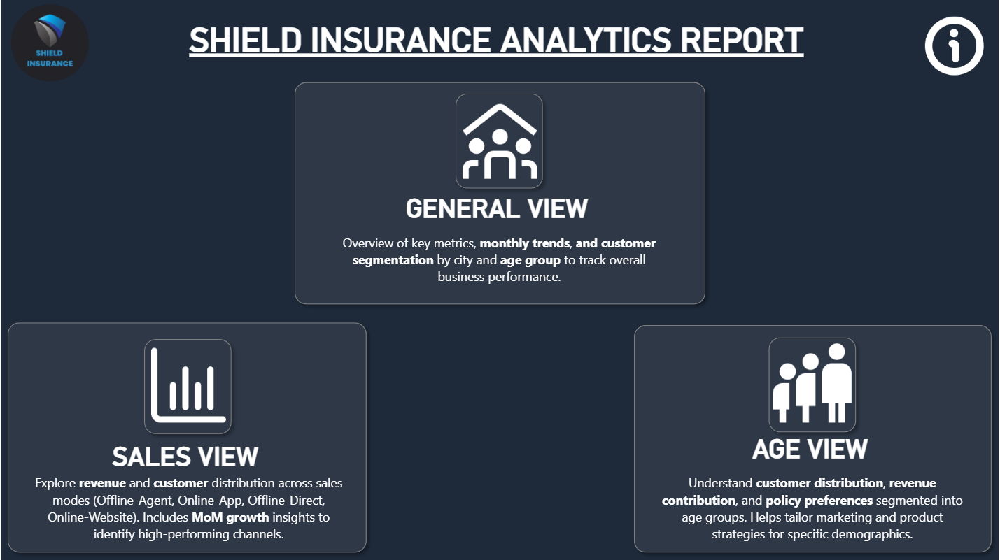
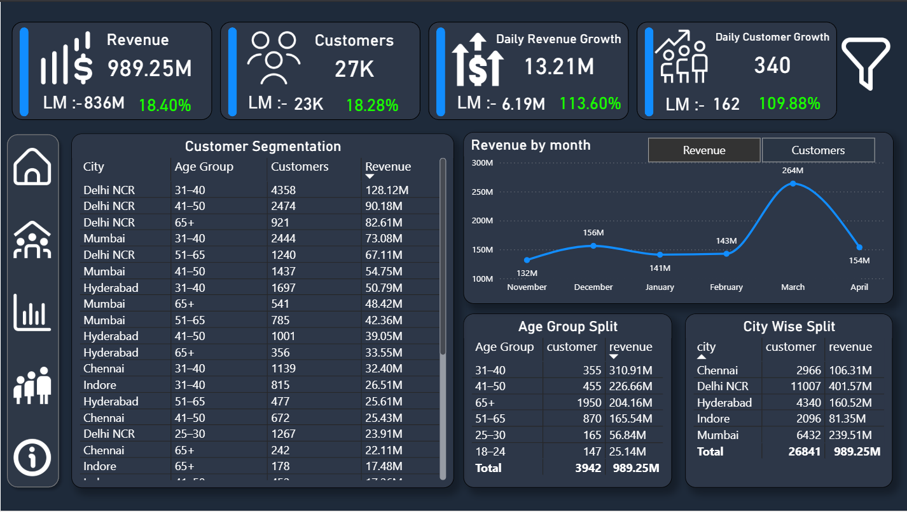
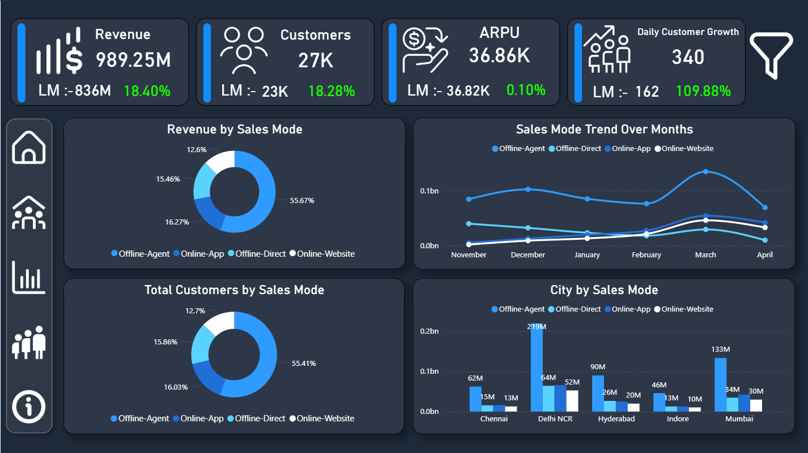
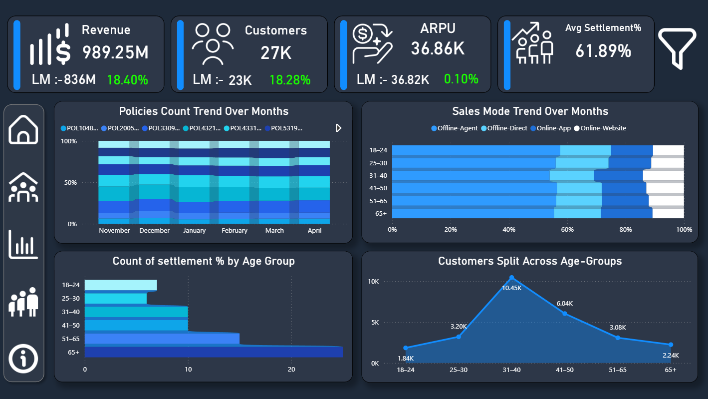

# 🛡️ Shield Insurance Analytics – Power BI Project

## 🏢 Company: Shield Insurance

---

## 📌 Project Overview

Shield Insurance is a rapidly growing insurance company seeking deeper visibility into its **customer behavior, revenue trends, policy performance, and sales channel effectiveness**.

This Power BI project delivers a **multi-page analytical dashboard** that provides a 360° business view — empowering stakeholders to make **confident, data-driven decisions** across customer segmentation, sales modes, and growth tracking.

🔗 [Live Dashboard](https://app.powerbi.com/view?r=eyJrIjoiZDEyZmE3NGQtOTY0NS00ZGMzLThkMmUtOWIxYTRjMDg0MWIwIiwidCI6ImM2ZTU0OWIzLTVmNDUtNDAzMi1hYWU5LWQ0MjQ0ZGM1YjJjNCJ9)
🔗 [LinkedIn Post](#)

---

## ⚙️ Tech Stack

- 📊 **Power BI Desktop** – Dashboard development & data storytelling
- 🧮 **DAX** – Custom measures, KPIs, and calculated columns
- 📑 **Excel** – Data source, cleaning & preprocessing
- 🗄️ **SQL** – Data extraction & transformation

---

## 🎓 Key Learnings & Features

- Translated business requirements into measurable KPIs
- Data modeling using **star schema** with fact & dimension tables
- Designed KPI cards for **Total Revenue, ARPU, Daily Growth Rates** with MoM comparisons
- Built a dynamic **Revenue ↔ Customer trend toggle** using bookmarks
- Age group and city-level **customer segmentation analysis**
- Sales mode performance comparison across digital and traditional channels
- Applied **filters, slicers, bookmarks, and page navigation** for seamless interactivity
- Clean, stakeholder-friendly UI with consistent dark-theme design

---

## 🧠 Business Concepts Covered

- **Revenue Analysis** – Total revenue, daily growth, and monthly trend tracking
- **Customer Insights** – Acquisition trends, segmentation by age group and city
- **Policy Trends** – Month-over-month policy count monitoring across policy IDs
- **Sales Mode Analysis** – Offline-Agent, Online-App, Offline-Direct, Online-Website performance
- **Settlement Monitoring** – Settlement percentage analysis across demographics

---

## 🧩 Data Model

**Dimension Tables:**
- `dim_customer`
- `dim_date`
- `dim_policies`

**Fact Tables:**
- `fact_premiums`
- `fact_settlements`

**Model Type:** Star Schema
**Data Source:** Excel (imported into Power BI)

---

## 📸 Dashboard Preview

### 🏠 Home Page

---

### 📊 General View Page

---

### 💳 Sales Mode Analysis Page

---

### 📋 Customer Segmentation Page

---

## ❓ Problem Statement

Shield Insurance needed a unified analytics solution to:

- Track **total revenue and daily/monthly customer growth**
- Understand **policy trends** on a month-over-month basis
- Identify **high-value customer segments** by age group and city
- Compare **sales channel (mode) performance** across geographies
- Analyze **settlement efficiency** across demographic groups

---

## 💡 Key Insights

- 📍 **Delhi NCR** is the highest-value market — 11,007 customers generating ₹401.57M in revenue
- 📍 The **65+ age segment**, despite smaller headcount, drives ₹204M — an underserved premium cohort
- 📍 **Offline-Agent** leads with 55.67% of total revenue, but online channels show a growth trajectory
- 📍 The **31–40 age group** has the largest customer base at 10.45K customers
- 📍 Daily customer growth surged **109.88% MoM** (162 → 340), validating current acquisition strategies

---

## ✅ Recommendations

- Target the **65+ segment** with tailored premium policy offerings — high revenue potential, currently underserved
- Invest in **digital channel infrastructure** (Online-App, Online-Website) to capture the younger demographic shift
- Double down on **Delhi NCR and Mumbai** as primary revenue markets while developing emerging cities like Indore
- Improve **settlement processes** for the 51–65 and 65+ age groups to strengthen trust and retention

---

## 🎯 Project Outcome

The Shield Insurance Analytics Dashboard serves as a **single source of truth** for leadership:

- Real-time KPIs enabling quick, confident decision-making
- Clear visibility into customer acquisition and revenue trends
- Strategic segmentation to guide marketing and product targeting
- Operational insights for settlement efficiency improvement

---

## 🙏 Acknowledgements

A huge thank you to **[Codebasics](https://codebasics.io/)** for providing this real-world project as part of their analytics curriculum. The hands-on, industry-grade project structure is what truly bridges the gap between learning and professional practice.

Special gratitude to mentors **Dhaval Patel** and **Hemanand** for their structured guidance, clarity of thought, and the depth of knowledge they bring — your mentorship shaped the analytical approach behind this project.

---

## 👨‍💻 Author

**Your Name**

- 🔗 [LinkedIn](https://linkedin.com/in/your-profile)
- 🌐 [Portfolio](https://your-portfolio-link.com)
